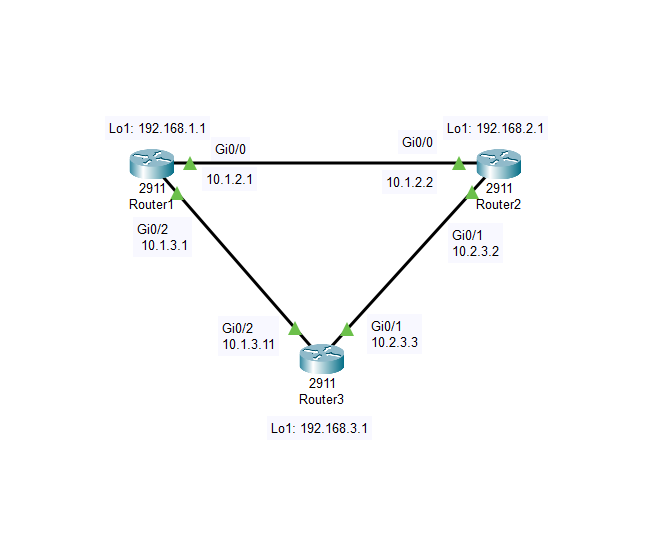

# RoutingAndSwitching-Labs
An in-depth repository dedicated to various network topologies explored and tested throughout my CCNA journey. This laboratory represents a structured approach to understanding, designing, and troubleshooting different network configurations.

