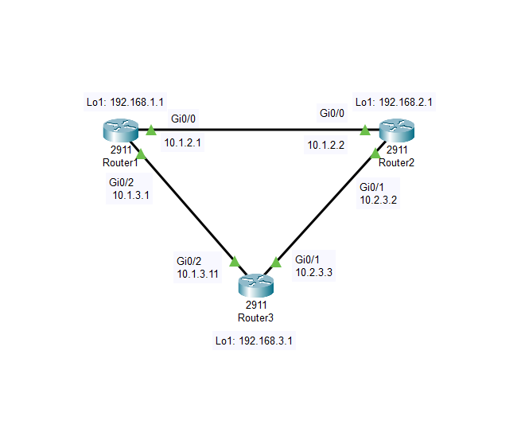

# RoutingAndSwitching-Labs
An in-depth repository dedicated to various network topologies explored and tested throughout my CCNA journey. This laboratory represents a structured approach to understanding, designing, and troubleshooting different network configurations.

Tasks
Connectivity between three routers has been established, and IP services must be configured in the order presented
to complete the implementation. Tasks assigned include configuration of NAT, NTP, DHCP, and SSH services.
1. All traffic sent from R3 to the R1 Loopback address must be configured for NAT on R2. All source addresses must
be translated from R3 to the IP address of Ethernet0/0 on R2, while using only a standard access list named NAT. To
verify, a ping must be successful to the R1 Loopback address sourced from R3. Do not use NVI NAT
configuration.
2. Configure R1 as an NTP server and R2 as a client, not as a peer, using the IP address of the R1 Ethernet0/2
interface. Set the clock on the NTP server for midnight on January 1, 2019.
3. Configure R1 as a DHCP server for the network 10.1.3.0/24 in a pool named NETPOOL. Using a single command,
exclude addresses 1-10 from the range. Interface Ethernet0/2 on R3 must be issued the IP address of 10.1.3.11 via
DHCP.
4. Configure SSH connectivity from R1 to R3, while excluding access via other remote connection protocols. Access
for user netadmin and password N3t4ccess must be set on router R3 using RSA and 1024 bits. Verify connectivity
using an SSH session from router R1 using a destination address of 10.1.3.11. Do NOT modify console access or
line numbers to accomplish this task.Solution
Note: Please check the ACL name username, password, clock… carefully in your exam as they may be different!
Task 1:
R2(config)# ip access-list standard NAT //Note: The name of the ACL may be different so please check carefully!
R2(config-std-nacl)#permit 10.2.3.3
R2(config-std-nacl)#permit 192.168.3.1
R2(config-std-nacl)#permit 10.1.3.11
R2(config-std-nacl)#exit
R2(config)# interface e0/1
R2(config-if)#ip nat inside
R2(config-if)#exit
R2(config)#interface e0/0
R2(config-if)#ip nat outside
R2(config-if)#exit
R2(config)#ip nat inside source list NAT interface e0/0 overload
Verification
R3#ping 192.168.1.1
.!!!! (ping should work)
Task 2:
R1#clock set 00:00:00 January 1 2019 //Midnight means 00:00:00. Note: The date may be different so please
check carefully!
R1#config t
R1(config)#ntp master 1 //Configure R1 as an NTP server
A strange thing of this sim is that E0/2 of R1 has not been configured an IP address so we must assign the IP
address of 10.1.3.1 as shown in the topology for it. Maybe it is the reason the requirement says “using the IP
address of the R1 Ethernet0/2 interface”.
R1(config)#interface e0/2
R1(config)#ip address 10.1.3.1 255.255.255.0
Configure R2 as the NTP client (not NTP peer):
R2#config t
R2(config)#ntp server 10.1.3.1
Verification
Check the clock on R2 to see if it is the same as R1:
R2#show clock
0:0:01.60 UTC Tue Jan 1 2019
Task 3:
R1(config)#ip dhcp pool NETPOOL
R1(dhcp-config)#network 10.1.3.0 255.255.255.0
R1(dhcp-config)#exit
R1(config)#ip dhcp excluded-address 10.1.3.1 10.1.3.10
Configure interface E0/2 of R3 to receive IP address issued from R1 (DHCP Server):
R3(config)#interface e0/2
R3(config-if)#ip address dhcpVerification
R3(config-if)#exit
R3(config)#exit
R3#show ip interface brief (E0/2 interface is assigned the IP address of 10.1.3.11)
Interface IP-Address OK? Method Status Protocol
…
Ethernet0/2 10.1.3.11 YES DHCP up up
Task 4:
R3(config)#line vty 0 4 //we should use the “show run” command to confirm if the “line vty 0 4” or “line vty 0 15”
R3(config-line)#transport input ssh
R3(config-line)#login local
R3(config-line)#exit
R3(config)#username netadmin password N3t4ccess //Note: Please check the username and password given
carefully. It may not be “netadmin” and “N3t4ccess” as shown here
R3(config)#crypto key generate rsa modulus 1024
Note: The command “ip domain-name xyz.com” has been configured so we don’t need to type this command again.
This command must be used before the “crypto key generate rsa” command or an error will be shown.
Verification
R1# ssh -l netadmin 10.1.3.11
Password: {please type N3t4ccess here}

