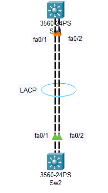
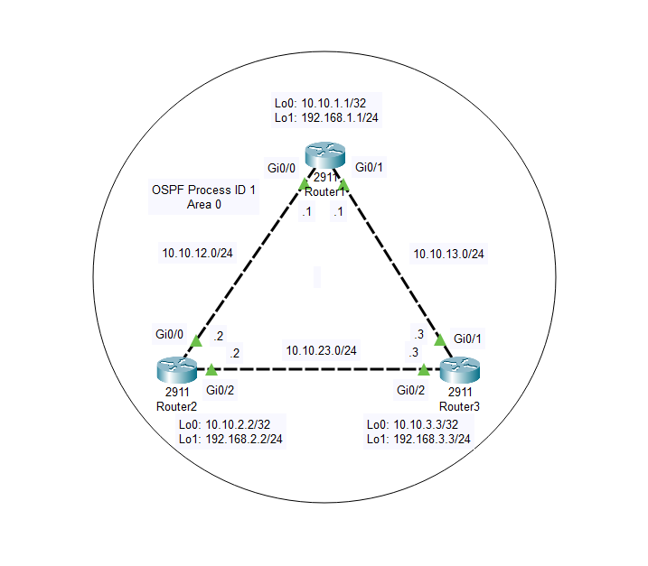
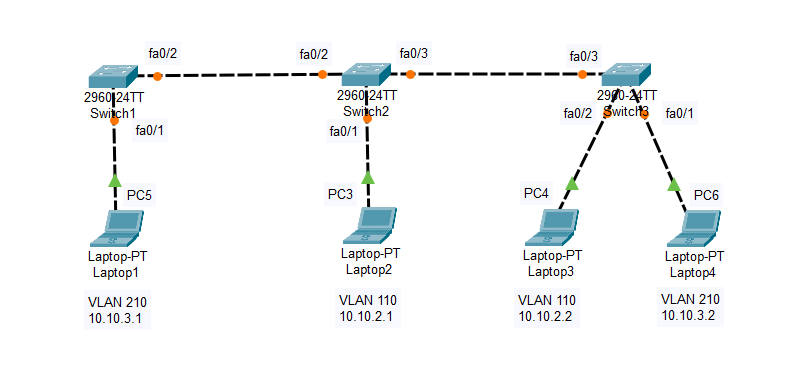
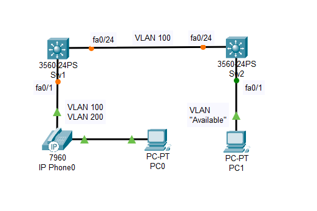

# CCNA Routing And Switching Labs Practice
An in-depth repository dedicated to various network topologies explored and tested throughout my CCNA journey. This laboratory represents a structured approach to understanding, designing, and troubleshooting different network configurations.

Tasks
Connectivity between three routers has been established, and IP services must be configured in the order presented
to complete the implementation. Tasks assigned include configuration of NAT, NTP, DHCP, and SSH services.

1. All traffic sent from R3 to the R1 Loopback address must be configured for NAT on R2. All source addresses must
be translated from R3 to the IP address of Ethernet0/0 on R2, while using only a standard access list named NAT. To
verify, a ping must be successful to the R1 Loopback address sourced from R3. Do not use NVI NAT
configuration.

3. Configure R1 as an NTP server and R2 as a client, not as a peer, using the IP address of the R1 Ethernet0/2
interface. Set the clock on the NTP server for midnight on January 1, 2019.

5. Configure R1 as a DHCP server for the network 10.1.3.0/24 in a pool named NETPOOL. Using a single command,
exclude addresses 1-10 from the range. Interface Ethernet0/2 on R3 must be issued the IP address of 10.1.3.11 via
DHCP.

7. Configure SSH connectivity from R1 to R3, while excluding access via other remote connection protocols. Access
for user netadmin and password N3t4ccess must be set on router R3 using RSA and 1024 bits. Verify connectivity
using an SSH session from router R1 using a destination address of 10.1.3.11. Do NOT modify console access or
line numbers to accomplish this task.Solution

### Task 1:
R2(config)# ip access-list standard NAT
R2(config-std-nacl)#permit 10.2.3.3
R2(config-std-nacl)#permit 192.168.3.1
R2(config-std-nacl)#permit 10.1.3.11
R2(config-std-nacl)#exit
R2(config)# interface e0/1
R2(config-if)#ip nat inside
R2(config-if)#exit
R2(config)#interface e0/0
R2(config-if)#ip nat outside
R2(config-if)#exit
R2(config)#ip nat inside source list NAT interface e0/0 overload

**Verification**:
R3#ping 192.168.1.1
(Expect `.!!!!` - ping should work)

### Task 2:
R1#clock set 00:00:00 January 1 2019 //Midnight means 00:00:00. Note: The date may be different so please check carefully!
R1#config t
R1(config)#ntp master 1 //Configure R1 as an NTP server
(Note: A strange thing of this sim is that E0/2 of R1 hasn't been configured with an IP address, so we must assign the IP address of 10.1.3.1 as shown in the topology for it.)

R1(config)#interface e0/2
R1(config-if)#ip address 10.1.3.1 255.255.255.0

Configure R2 as the NTP client (not NTP peer):
R2#config t
R2(config)#ntp server 10.1.3.1

**Verification**:
R2#show clock
(Expect `0:0:01.60 UTC Tue Jan 1 2019`)

### Task 3:
R1(config)#ip dhcp pool NETPOOL
R1(dhcp-config)#network 10.1.3.0 255.255.255.0
R1(dhcp-config)#exit
R1(config)#ip dhcp excluded-address 10.1.3.1 10.1.3.10

Configure interface E0/2 of R3 to receive IP address from R1 (DHCP Server):
R3(config)#interface e0/2
R3(config-if)#ip address dhcp
R3(config-if)#exit

**Verification**:
R3#show ip interface brief

(Expect `Ethernet0/2 10.1.3.11 YES DHCP up up`)

### Task 4:
R3(config)#line vty 0 4 //We should use the “show run” command to confirm if it's “line vty 0 4” or “line vty 0 15”
R3(config-line)#transport input ssh
R3(config-line)#login local
R3(config-line)#exit
R3(config)#username netadmin password N3t4ccess
R3(config)#crypto key generate rsa modulus 1024

(Note: The command “ip domain-name xyz.com” has already been configured, so we don’t need to repeat this command.)

**Verification**:
R1# ssh -l netadmin 10.1.3.11
(When prompted for a password, type `N3t4ccess`)

LACP_Configuration_Simulation

### Tasks
Physical connectivity is implemented between the two Layer 2 switches, and the network connectivity between them
must be configured.
1. Configure an LACP EtherChannel and number it as 44; configure it between switches SW1 and SW2 using
interfaces Ethernet0/0 and Ethernet0/1 on both sides. The LACP mode must match on both ends.
2. Configure the EtherChannel as a trunk link.
3. Configure the trunk link with 802.1q tags.
4. Configure VLAN ‘MONITORING’ as the untagged VLAN of the EtherChannel.Solution

### Task 1 + 2 + 3.
SW1, SW2:
interface range E0/0 – 1
channel-group 44 mode active
no shutdown
interface Port-channel 44
switchport trunk encapsulation dot1q
switchport mode trunk

### Task 4.

SW1, SW2:
interface Port-channel 44
switchport trunk native vlan 746
Don’t forget to save the configuration on both switches:
SW1, SW2#copy running-config startup-config

OSPF_Configuration_Simulation
Tasks
IP connectivity between the three routers is configured. OSPF adjacencies must be established.
1. Configure R1 and R2 Router IDs using the interface IP addresses from the link that is shared between them.
2. Configure the R2 links with a max value facing R1 and R3. R2 must become the DR. R1 and R3 links facing R2
must remain with the default OSPF configuration for DR election. Verify the configuration after clearing the OSPF
process.
3. Using a host wildcard mask, configure all three routers to advertise their respective Loopback1 networks.
4. Configure the link between R1 and R3 to disable their ability to add other OSPF routers.
Solution

### Task 1. Configure R1 and R2 Router IDs using the interface IP addresses from the link that is shared between them.
R1(config)#router ospf 1
R1(config-router)#router-id 10.10.12.1
R2(config)#router ospf 1
R2(config-router)#router-id 10.10.12.2
Verification
R1#clear ip ospf process
Reset ALL OSPF processes? [no]: yR1#show ip ospf
Routing Process “ospf 1” with ID 10.10.12.1
R2#clear ip ospf process
Reset ALL OSPF processes? [no]: y
R2#show ip ospf
Routing Process “ospf 1” with ID 10.10.12.2

### Task 2. Configure the R2 links with a max value facing R1 and R3. R2 must become the DR. R1 and R3 links facing
R2 must remain with the default OSPF configuration for DR election. Verify the configuration after clearing the OSPF
process.
The max value of OSPF priority is 255 so we assign this value to E0/0 and E0/2 interfaces of R2, which are facing R1
& R3.
On R2:
R2(config)#interface e0/0
R2(config-if)#ip ospf priority 255
R2(config-if)#interface e0/2
R2(config-if)#ip ospf priority 255
R2(config-if)#exit
R2(config)#exit

Verification
This task asks us to clear the OSPF process first:
R2#clear ip ospf process
Reset ALL OSPF processes? [no]: y
and then verify the configuration:
R2#show ip ospf neighbor
10.10.12.1 1 FULL/BDR 00:00:39 10.10.12.1 Ethernet0/0
192.168.3.3 1 FULL/BDR 00:00:39 10.10.23.3 Ethernet0/2
Our configuration is correct if we see our two OSPF neighbors are BDRs so R2 is DR. Or we can check on R1 & R3 to
see R2’s priority and its role. For example on R1:
R1#sh ip ospf neighbor
Neighbor ID Pri State Dead Time Address Interface
10.10.12.2 255 FULL/DR 00:00:37 10.10.12.2 Ethernet0/0
192.168.3.3 1 FULL/DR 00:00:37 10.10.13.3 Ethernet0/1
And on R3:
R3#show ip ospf neighbor
Neighbor ID Pri State Dead Time Address Interface
10.10.12.1 1 FULL/BDR 00:00:37 10.10.13.1 Ethernet0/1
10.10.12.2 255 FULL/DR 00:00:37 10.10.23.2 Ethernet0/2Task 3. Using a host wildcard mask, configure all three routers to advertise their respective Loopback1 networks.
This task requires to use “host wildcard mask” so we have to use “0.0.0.0” for the wildcard mask here. Notice that it
is still correct and match the exact Loopback 1 IP addresses only.
R1(config)#router ospf 1
R1(config-router)#network 192.168.1.1 0.0.0.0 area 0
R2(config)#router ospf 1
R2(config-router)#network 192.168.2.2 0.0.0.0 area 0
R3(config)#router ospf 1
R3(config-router)#network 192.168.3.3 0.0.0.0 area 0
Verification
We can check to see if the Loopback1 networks have been advertised with the “show ip route” command or the
“show ip route ospf” command (this command is same as the first one but it only shows OSPF learned routes):
R3#show ip route ospf
10.0.0.0/8 is variably subnetted, 6 subnets, 2 masks
O 10.10.12.0 [110/2] via 10.10.13.1, 00:13:11, Ethernet0/1
[110/2] via 10.10.23.2, 00:13:11, Ethernet0/2
192.168.1.0/32 is subnetted, 1 subnets
O 192.168.1.1 [110/2] via 10.10.13.1, 00:01:08, Ethernet0/1
192.168.2.0/32 is subnetted, 1 subnets
O 192.168.2.2 [110/2] via 10.10.23.2, 00:00:51, Ethernet0/2
-> We can see two other Loopback1 networks so our configuration was correct.

### Task 4. Configure the link between R1 and R3 to disable their ability to add other OSPF routers.
Use these commands on both R1 & R3:
R1,R3(config)#interface e0/1
R1,R3(config)#ip ospf network point-to-point

After using these commands on both routers the OSPF process on this segment is up again.
Verification
R3#sh ip ospf neighbor
Neighbor ID Pri State Dead Time Address Interface
10.10.12.1 0 FULL/ - 00:00:39 10.10.13.1 GigabitEthernet0/1
10.10.12.2 255 FULL/DR 00:00:30 10.10.23.2 GigabitEthernet0/2
This is a point-to-point network so we cannot add other OSPF routers to R1-R3 segment.

VLAN_and_Trunking_Configuration_Simulation

Voice_VLAN_Configuration_Simulation
